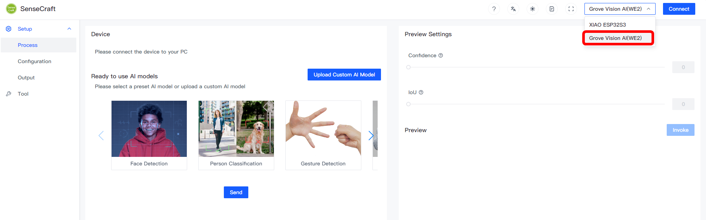
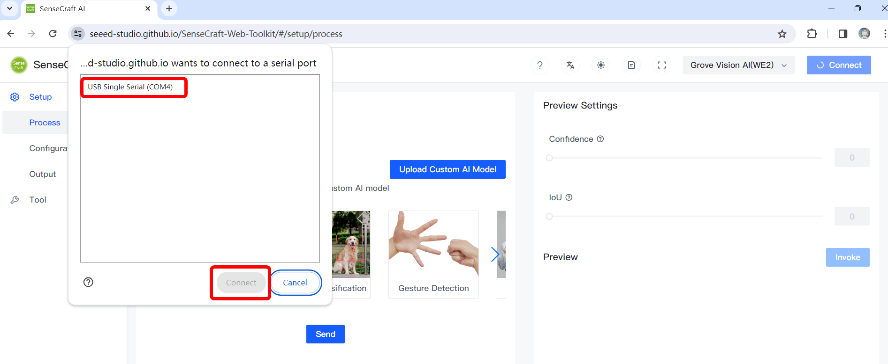
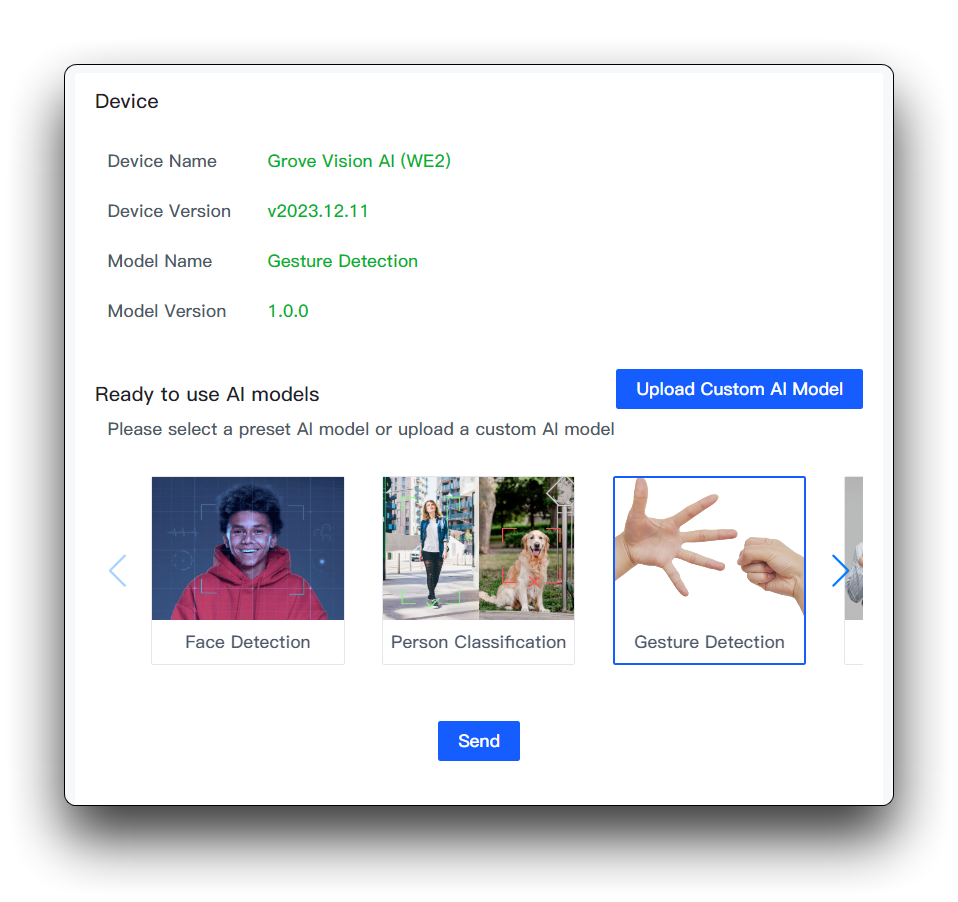
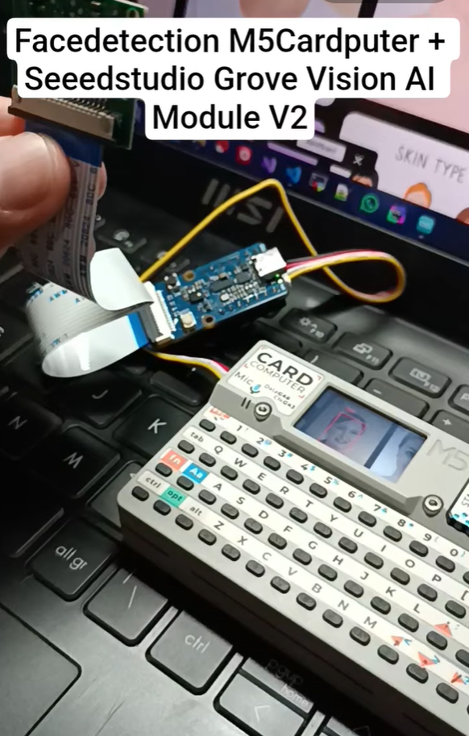
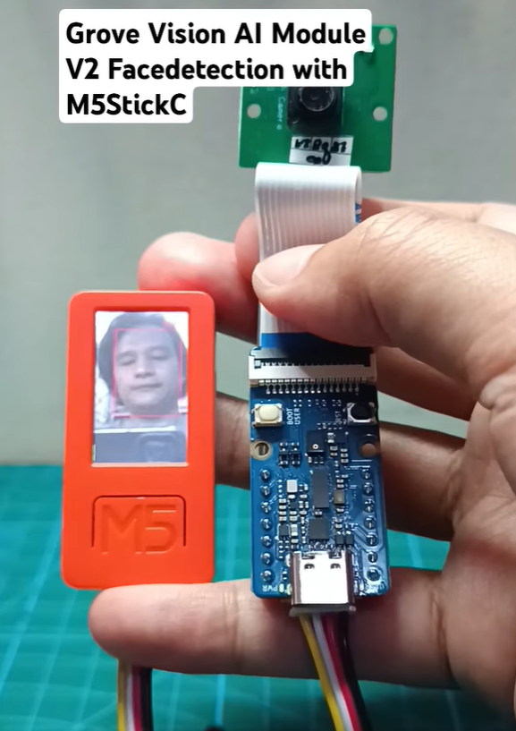
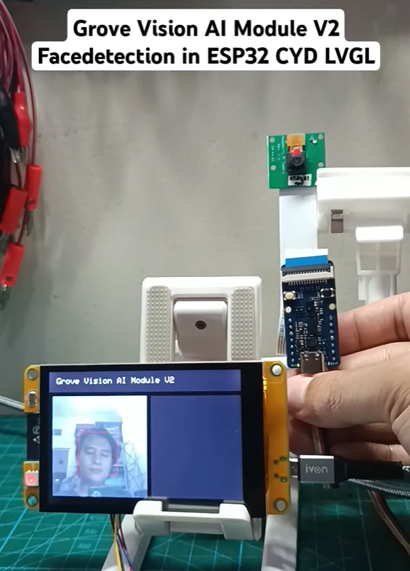

# Grove-Vision-AI-Module-V2-Project
List of my personal Grove Vision AI Module V2 Project  
#### Flash Grove Vision AI Module
- Connect Grove Vision AI Module to Camera and connect to your computer vis USB cable,  

- Open [Sense Craft AI Tool Kit](https://seeed-studio.github.io/SenseCraft-Web-Toolkit/#/setup/process) in your browser and Select Grove Vision AI V2 on top-right corner,

- Choose connected device (COM Port),

- Choose **Face Detection** project,

- Read more for detailed instruction in [Grove Vision AI Module V2
 Documentation](https://wiki.seeedstudio.com/grove_vision_ai_v2a/)
### Flash SSCMA Viewer
- I made several option to view inference result from Grove Vision AI V2,
#### M5Stick C Plus
- Open `M5Cardputer_Inference_SSCMA/` in Arduino IDE, 
- Connect M5Cardputer to your computer via USB cable,
- Set target board and port in Arduino IDE,
- Build and upload the code to M5Cardputer, 
- Connect Grove Vision AI Module V2 to M5Stick C using Grove Cable.

#### M5Stick C Plus
- Open `M5StickC_Inference_SSCMA/` in Arduino IDE, 
- Connect M5Stick C to your computer via USB cable,
- Set target board and port in Arduino IDE,
- Build and upload the code to M5Stick C, 
- Connect Grove Vision AI Module V2 to M5Stick C using Grove Cable.

#### CYD (Cheap-yellow-display) 32' 3248S035
- Open `CYD_32inch_Inference_SSCMA/` in Arduino IDE, 
- Connect CYD to your computer via USB cable,
- Set target board and port in Arduino IDE,
- Build and upload the code to CYD, 
- Connect Grove Vision AI Module V2 to CYD using custom Grove Cable with Grove connector in one-side and 4P 1.25 mm JST connector in other-side.

